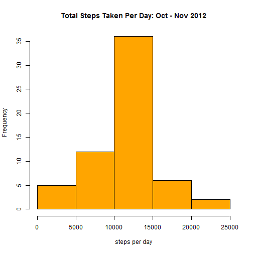

## Loading and preprocessing the data
It is assumed that the current working directory contains activity.csv

```r
act <- read.csv("activity.csv")
```

## What is mean total number of steps taken per day?
Excluding observations with missing values

```r
library(plyr)
spd <- ddply(na.omit(act), ~date, summarize, steps_per_day=sum(steps))
hist(spd$steps_per_day, main="Total Steps Taken Per Day: Oct - Nov 2012",
     xlab="steps per day", col="light blue")
```

 

Mean and median number of steps taken per day:  

```r
mean(spd$steps_per_day)
```

```
## [1] 10766.19
```

```r
median(spd$steps_per_day)
```

```
## [1] 10765
```


## What is the average daily activity pattern?

```r
msi <- ddply(act, ~interval, summarize, avg_steps_interval=mean(steps, na.rm=TRUE))
plot(msi$interval, msi$avg_steps_interval, typ='l', 
     main="Mean Number of Steps Taken Per 5-minute Interval: Oct - Nov 2012", 
     xlab="interval", ylab="Mean # steps taken")
```

 

```r
subset(msi, msi$avg_steps_interval==max(msi$avg_steps_interval))
```

```
##     interval avg_steps_interval
## 104      835           206.1698
```
The 5 minute interval beginning at 8:35 AM has the maximum average number of steps.

## Imputing missing values
Number of missing values:

```r
sum(is.na(act))
```

```
## [1] 2304
```
Missing values of steps will be replaced with the mean number of steps for the interval
over the 2 month period.

```r
act2 <- merge(x = act, y = msi, by = "interval", all.x = TRUE)
for (i in 1:nrow(act2)) 
{
    if (is.na(act2[i,2])) {
        act2[i,2] <- act2[i,4]
    }
}
spd_imp <- ddply(act2, ~date, summarize, steps_per_day=sum(steps))

hist(spd_imp$steps_per_day, main="Total Steps Taken Per Day: Oct - Nov 2012", 
     xlab="steps per day", col="orange")
```

 

Mean and median number of steps taken per day with missing values imputed:  

```r
mean(spd_imp$steps_per_day)
```

```
## [1] 10766.19
```

```r
median(spd_imp$steps_per_day)
```

```
## [1] 10766.19
```
The mean number of steps is the same as the previous calculation (ignoring missing values).  With the imputation of missing data, the median is equal to the mean.    


## Are there differences in activity patterns between weekdays and weekends?

```r
library(lattice)
act2$day_type <- ifelse(weekdays(as.Date(act2$date))=="Saturday" | 
                        weekdays(as.Date(act2$date))=="Sunday", "weekend", "weekday")
msi_imp <- ddply(act2, c('interval','day_type'), summarize, 
                 avg_steps_interval_imp=mean(steps))
xyplot(avg_steps_interval_imp ~ interval | day_type, data=msi_imp, layout=c(1,2), 
       type="l", xlab="5 minute interval" , ylab="Mean # steps taken")
```

 
